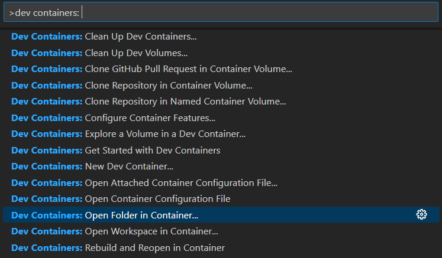
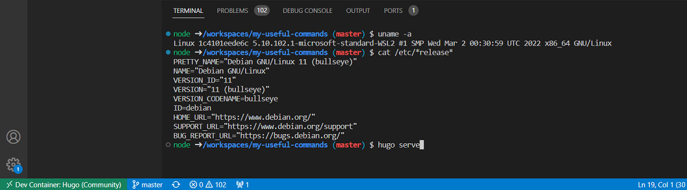

---
title: "Instantly Set Up Your Development Environment with DevContainer's One-Click Setup"
date: 2023-04-10T01:11:15+05:30
lastmod: 2023-04-10T01:29:01+08:00
draft: false
author: "Vidhya"
description: ""

tags: ["devcontainer", "tools"]
categories: ["devcontainer","tools","code"]

resources:
- name: "featured-image"
  src: "coding-devcontainer.jpg"

toc:
  auto: true  
---
## Introduction

👋 Are you tired of dealing with frustrating issues when setting up a development environment on a new machine? Or struggling with collaboration problems due to different setups across team members 👥👥 ?

With DevContainers, you can:

- ✅ Define a set of tools, configurations, and dependencies in a Docker container
- 🚀 Instantly set up your development environment with just one click
- 🌀 Create consistent and isolated development environments that can be shared and reused across different machines and platforms

In this blog post, we'll explore the features and benefits of using DevContainers. We'll discuss how they can streamline your development workflow, make collaboration with other developers easier, and solve the "works on my machine" problem.

So, if you're ready to improve your development process and avoid the headaches of dealing with different environments, let's dive in and learn more about DevContainers!



## What is devcontainer

🐳 DevContainers is a feature in the Visual Studio Code editor that allows developers to create consistent and isolated development environments using containers.

🚀👨‍💻 DevContainers can simplify the process of setting up a development environment, improve consistency across different environments, and facilitate collaboration with other developers.  making it easier for teams to standardize their development processes.




## Requirements

1. 🖥️ **Visual Studio Code editor:** DevContainers is a feature in the Visual Studio Code editor, so you'll need to have it installed on your machine. with VS code devcontainer extensions https://marketplace.visualstudio.com/items?itemName=ms-vscode-remote.remote-containers

2. 🐳 **Docker:** DevContainers uses Docker to create and manage the development environment in a container. You'll need to have Docker installed on your machine and running. 
  I would suggest Rancher desktop  , as it is enterprise free, where as docker destop   is licensed for enterprise. Personally I use rancher. 


4. 🔍 **Code repository:** DevContainers are typically used within a code repository. You'll need to have your code repository set up with the DevContainer specification file included in the project.

By meeting these basic requirements, you'll be able to set up a development environment using DevContainers in Visual Studio Code.

## How to run this blog with single click

 🛠️ **DevContainer specifications:** To define the configuration for the development environment, you'll need to create a DevContainer specification file (either "devcontainer.json" or "devcontainer.yml") in your project's code repository.

 1. Checkout the  blog repository

   ```
    git clone https://github.com/vidhya03/my-useful-commands.git
   ```

  
 > Refer the pre-configured devcontainer specifications. 
 >    https://github.com/vidhya03/my-useful-commands/blob/master/.devcontainer/devcontainer.json
 >     
 >   ```json
 >    {
>	"name": "Hugo (Community)",
>	"build": {
>		"dockerfile": "Dockerfile",
 >   .
 >   .
 >   .
 >   .
>
 >   ```
 >   `build.dockerfile` - The [Dockerfile](https://github.com/vidhya03/my-useful-commands/blob/master/.devcontainer/Dockerfile) location, which defines >the container contents, is specified relative to the devcontainer.json file path.
 

 2. Start the docker - in my case rancher desktop
 3. Start VS Code
 4. Run the `Dev Containers: Open Folder in Container...` command

   - Press `F1` and type >dev containers: and choose Open folder in container...
      
   - First time the container takes 30seconds to 1 min or depends upon the dependency. And subsecquent  it will be blazing fast
   - After you have started the container and established a connection, you can verify that the remote context has been updated by checking the bottom left of the Status bar.
 5. To start the blog, run the command ```hugo serve``` command in devcontainer terminal

    

  


>In the next blog i will explain you complex set-up , docker in kubernetes and advanced dev environment configurations. 


## Important links

1. VS code devcontainer extensions
 https://marketplace.visualstudio.com/items?itemName=ms-vscode-remote.remote-containers
2. Reference Specification - Dev Container metadata reference
 https://containers.dev/implementors/json_reference/


