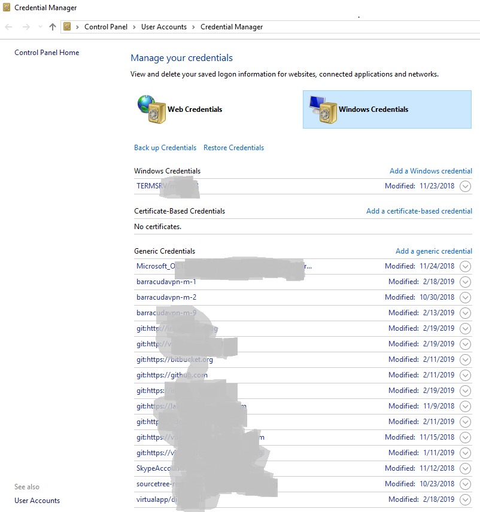

Useful git commands :two_hearts:

## Table of contents

- [How to see my last commit](#how-to-see-my-last-commit)
- [How to output git log with the first line only?](#how-to-output-git-log-with-the-first-line-only)
- [How can i view a git log of just one user](#how-can-i-view-a-git-log-of-just-one-user)
- [How do I force git pull to overwire local files](#how-do-i-force-git-pull-to-overwire-local-files)
- [How do I determine the url of git repository](#how-do-i-determine-the-url-of-git-repository)
- [How do I go to specific revision](#how-do-i-go-to-specific-revision)
- [How do I tag a specific commit](#how-do-i-tag-a-specific-commit)
- [How do I delete a specific branch](#how-do-i-delete-a-specific-branch)
- [How to change author in a commit](#how-to-change-author-in-a-commit)
- [How to rename the git branch](#how-to-rename-the-git-branch)
- [How do I branch a specific commit](#how-do-i-branch-a-specific-commit)
- [How to reset the git password in windows](#how-to-reset-the-git-password-in-windows)
- [How to reset a git branch](#how-to-reset-a-git-branch)
- [How to reset a local commit](#how-to-reset-a-git-branch)
- [How to resolve merge conflicts](#how-to-resolve-merge-conflicts)
- [How to view git stash files](#how-to-view-git-stash-files)
- [How to git stash specific files under a path](#Git-stash-specific-files-under-a-path)
- [How to revert merge commit](#how-to-revert-merge-commit)
- [How to pick a commit from one branch to another using cherry-pick](#how-to-pick-a-commit-from-one-branch-to-another-using-cherry-pick)
- [How to fix or solve No url found for submodule path in .gitmodules](#how-to-fix-or-solve-no-url-found-for-submodule-path-in-gitmodules)
- [How to pass custom ssh private key filename](#how-to-pass-custom-ssh-private-key-filename)
- [How to add new line in shell - git commit message](#how-to-add-new-line-in-shell---git-commit-message)


## How to see my last commit

This command is useful to see 'my last commit'

```md
git log --name-status HEAD^..HEAD
```

## How to output git log with the first line only

This command is useful to print commit history by one line

```md
git log --pretty=oneline --abbrev-commit
```

## How can i view a git log of just one user

This command is useful to see log by particular user

```md
git log --author="vidhya"
```

will match a commit made by "Vidhyadharan Deivamani" and also

```md
git log --author=deiva
```

[credits](https://stackoverflow.com/questions/4259996/how-can-i-view-a-git-log-of-just-one-users-commits?answertab=active#tab-top)

## How do I force git pull to overwire local files

This command is useful when you got git < branch > | MERGING issues

```md
git fetch --all
git reset --hard origin/master
```

or

```md
git reset --hard origin/<branch_name>
```

Note: the above command will overwrite your local files

[credits](https://stackoverflow.com/questions/1125968/how-do-i-force-git-pull-to-overwrite-local-files#8888015)

## How do I determine the url of git repository

Get only the remote url

```md
git config --get remote.origin.url
```

or

Get the entire url

```md
 git remote show origin
```

[credits](https://stackoverflow.com/questions/4089430/how-can-i-determine-the-url-that-a-local-git-repository-was-originally-cloned-fr?answertab=active#tab-top)

## How do I go to specific revision

Move to a specific commit or checkout to previous revision

First note the sha or revision number

```md
git log --pretty=oneline --abbrev-commit
```

Then

Check out the specific commit

```md
 git checkout <sha1 or revision>
```

[credits](https://stackoverflow.com/questions/7539130/go-to-particular-revision?answertab=active#tab-top)

## How do I tag a specific commit

Tag a specific commit

First note the sha or revision number

```md
git log --pretty=oneline
```

Then

Tag with revision number

```md
 git tag -a v1.2 444554738120233382c5912ebbca32592ba765ad -m "Message here"
```

*Warning:* This creates tags with the current date

To add a tag with specific date, add GIT_COMMITTER_DATE  environment variable with this YYYY-MM-DD HH:MM format.

```md
 GIT_COMMITTER_DATE="2006-10-02 10:31" git tag -a v1.2 444554738120233382c5912ebbca32592ba765ad -m "Message here"
```

To push a single tag:

```md
git push origin <tag_name>
```

And the following command should push all tags (not recommended):

```md
git push --tags
```

[credits](https://stackoverflow.com/questions/4404172/how-to-tag-an-older-commit-in-git?answertab=active#tab-top)

## How do i delete a specific branch

To delete the git remote branch

```md
git push --delete origin <branch_name>
```

To delete the local branch

```md
git branch -D <branch_name>
```

## How to change author in a commit

Sometime working in opensource and closed source, you might commit closed source with your personal email id.

```md
git commit --amend --author="vidhyadharan deivamani <it.vidhyadharan@gmail.com>" -m "commit description"
```

```md
git commit --amend --reset-author
```

## How to rename the git branch

To rename git local and remote branch

- Rename your local branch and push to remote

```md
git branch -m old_branch_name  new_branch_name
git push --set-upstream origin new_branch_name
```

- Delete the old remote branch and push new branch name

```md
git push origin :old_branch_name  new_branch_name
```

## How do I branch a specific commit

You can create the branch via a hash:

```md
git branch branchname <sha1-of-commit>
```

To checkout the branch when creating it, use

```md
git checkout -b branchname <sha1-of-commit or HEAD~3>
```

## How to reset the git password in windows

Some times checkout works but failed to push, we might get authentication failed without user name password challenging, in that case we have to clear our local windows credentials

In windows 10 you can find Windows Credentials at :

#### Control Panel\User Accounts\Credential Manager

#### Control Panel\All Control Panel Items\Credential Manager --> Windows Credentials

for your git server and then you can update password by clicking edit button.



## How to reset a git branch

### How to reset a local commit

 Remove all the  local commit and reset to the original remote branch

```md
git reset --hard origin/master
```

## How to resolve merge conflicts

One of the challenging task is resolving merge conflicts on Pull Request. Below command help you to merge with theirs strategy

### Merge on theirs

Step 1:

```md
git checkout branch_A
git pull origin branch_B -X theirs
```

Step 2: After the merge conflicts are resolved, stage the changes accordingly, commit the changes and push.

```md
git commit
git push origin HEAD
or
git push origin origin/branch_A
```

Step 3: The pull request will be updated and marked as merged.

## How to view git stash files

git stash temporarily shelves (or stashes) changes you've made to your working copy so you can work on something else, and then come back and re-apply them later on. Stashing is handy if you need to quickly switch context and work on something else, but you're mid-way through a code change and aren't quite ready to commit.


```md
git stash list --name-status
git stash list --name-only
```

To view only the file name on a particular stash

```md
git stash show --name-only -p stash@{3}
git stash show --name-status -p stash@{3}
```

## How to git stash specific files under a path

```md
 git stash push -m "application conf" src/main/resources/config/
```

## How to revert merge commit

```md
 git revert -m 1 <commit-hash> 
 where commit-hash is the merge commit id
 git push -u origin master 
```

## How to pick a commit from one branch to another using cherry-pick

Some times we  need to copy a particular commit into another branch.
we can use cherry-pick

\-x  
    When recording the commit, append a line that says "(cherry picked from commit …​)" to the original commit message (e.g. backporting a fix to a maintenance branch for an older release from a development branch), adding this information can be useful.

```md
git checkout <branch you want to apply> or git checkout release_branch
git cherry-pick <commit hash> or git cherry-pick 3a756d18a21
or
 git cherry-pick -x 3a756d18a21

```

## How to fix or solve No url found for submodule path in .gitmodules

While working on submodules sometimes challenging , I initially add submoudles to different path and changed. While working on feature branch which is originally forked from initial submoudles. After merging in to develop branch showed bellow error

**fatal: No url found for submodule path 'gradle' in .gitmodules**

Execute the below command to check the index

```md
git ls-files --stage | grep 160000
```

In my case this gives the output


>160000 c33757f1ac59f1728cca17f6a1d999704fcbcaaf &nbsp;&nbsp;&nbsp;&nbsp; 0 &nbsp;&nbsp;&nbsp;&nbsp; gradle<br/> 
>160000 c33757f1ac59f1728cca17f6a1d999704fcbcaaf &nbsp;&nbsp;&nbsp;&nbsp; 0 &nbsp;&nbsp;&nbsp;&nbsp; sci-bas-root/gradle

Then later I deleted the problamatic submodules, in this case gradle

$git rm --cached  **path-to-submodule**

Hence  i executed this command

```md
git rm --cached gradle
git push
```

## How to pass custom ssh private key filename

When cloning and working on multiple repository from different accounts, maintaing the separate ssh file is apt way. The below will show you how to pass private key while cloning and override the default file id_rsa

```md
 git clone git@github.com:vidhya03/my-useful-commands.git --config core.sshCommand="ssh -i /v/tools/putty/keys/vidhya03-github_rsa"
```
or edit the .git/config file in the root directory and add the command sshcommand = ssh -i /v/tools/putty/keys/vidhya03-github_rsa under [core] 	

```md
[core]
	sshcommand = ssh -i /v/tools/putty/keys/vidhya03-github_rsa
```

## How to mirror a git repository

Sometimes we wanted to move one repository to another repository 

	git clone --mirror http://repo/myrepo.git
	cd myrepo.git/
	git remote set-url --push origin https://github.com/myorg/myrepo.git
	git fetch -p origin
	git push –mirror

## How to add new line in shell - git commit message

In Bash, you can use single quotes around the message and can just leave the quote open, which will make Bash prompt for another line, until you close the quote. Like this:

```
git commit -m ' 🐛 Fixed runtime issue

When connecting an api with multiple calls , Commit message body goes here


refer: footer label goes here
'
```


  Try  <a href="https://www.softwareag.cloud/site/product/webmethods-api.html#/?utm_source=labkit" ></a>

