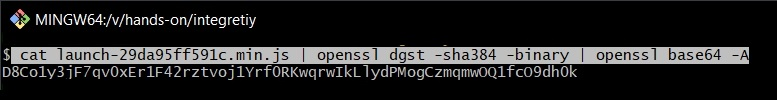

## Introduction
  - Ensuring the security and integrity of web resources is crucial in today's interconnected digital landscape.
  - Subresource integrity (SRI) is [W3C specification](https://www.w3.org/TR/SRI/)
 a powerful web security concept designed to protect against risks associated with external resource loading.  
  - SRI verifies the integrity of external resources, preventing tampering and ensuring their trustworthiness.
  - By incorporating SRI into web development practices, you can enhance the security and trustworthiness of your applications.
  - This blog will explore SRI, covering its concepts, benefits, implementation guidelines, and real-world use cases.
  - It aims to equip web developers, security enthusiasts, and curious individuals with the knowledge needed to effectively utilize SRI.
  - Understanding subresource integrity will provide insights into its inner workings and seamless integration into projects.
  - Let's embark on a journey into the fascinating realm of subresource integrity, where trust, security, and the integrity of web resources converge.

## Concept and Benefits of Subresource Integrity (SRI)

Subresource Integrity (SRI) is a powerful security feature in web development that ensures the integrity and authenticity of external resources loaded by web pages. It revolves around verifying that these resources, such as scripts, stylesheets, or fonts, have not been modified or tampered with since their original publication.

  - 🛡️ **Protection against Unauthorized Modifications**: SRI ensures that external resources remain unmodified, mitigating security risks.
  - 🤝 **Maintaining a Trusted User Experience**: SRI instills confidence by verifying the integrity of resources, assuring users they haven't been tampered with.
  - 🌟 **Enhanced Security for Third-Party Resources**: SRI secures external resources like CDNs, analytics scripts, or social media widgets.
  - 🛡️ **Protection from Supply Chain Attacks**: SRI defends against attacks injecting malicious code into trusted resources.
  - 💪 **Fortify Security Posture**: SRI strengthens web application security and protects against potential threats.

## Implementing Subresource Integritys
Implementing SRI involves a straightforward process. When referencing an external resource in your HTML document, include the integrity attribute within the corresponding `<script>`, `<link>`, or `` tag. The attribute value consists of the hashing algorithm used (e.g., "sha256" or "sha384") and the base64-encoded hash value. This way, the browser can verify the integrity of the fetched resource before executing or applying it.

To include an SRI hash in an HTML document, you can use the integrity attribute within the corresponding `<script>`, `<link>`, or `` tag. The integrity attribute value consists of the hashing algorithm used (e.g., "sha256" or "sha384") followed by a dash and the base64-encoded hash value.

Here's an example of using SRI with a `<script>` tag:

```js
<script src="https://example.com/example.js" integrity="sha256-qzvcPv9OX9t7x9sz5TnMmPy+OUrOemx+5SEIL+D4sZ8=" crossorigin="anonymous"></script>

```
### Generating Integrity Hashes:

The first step is to generate the integrity hashes for the resources you want to protect. This can be done using various tools and libraries available online.


 - Using openssl command we can generate hash, download the file and execute the below command 
  ```sh
  $ cat launch-29da95ff591c.min.js | openssl dgst -sha384 -binary | openssl base64 -A  
  ```
  here is how you can generate hash with the help of gitbash tool on windows
  
  Example:
  In your HTML code, when referencing the JavaScript file, add the `integrity` attribute with the calculated hash:
  ```html
  <script integrity="sha384-D8Co1y3jF7qv0xEr1F42rztvoj1Yrf0RKwqrwIkLlydPMogCzmqmwOQ1fcO9dh0k" type="text/javascript" src="https://assets.analytics-domain.com/launch-29da95ff591c.min.js" async></script>
  ```
  the prefix sha384 indicates that it's a `sha384` hash.

 - We can also generate hash from online tool https://www.srihash.org/ 

## Blocking / Defending 

When subresource integrity (SRI) is implemented and the integrity of a script file doesn't match the expected hash, the browser will take a specific action to maintain the security and integrity of the web page. The exact behavior or error message may vary slightly depending on the browser, but typically it results in the following:

  - **Script Blocked**: The browser prevents the execution of the script file if the integrity check fails. The script is not loaded or executed on the web page.
  - **Console Warning/Error**: The browser's developer console may display a warning or error message indicating that the script failed the integrity check. This helps developers identify the issue and take appropriate actions.
  - **Network Error**: In some cases, the browser's network tab in the developer console may show an error message indicating that the script file failed to load due to a failed integrity check. This can be helpful for debugging and identifying the cause of the issue.

## Conclusion

- 🧱 **Subresource Integrity (SRI)**: A powerful security measure that protects web applications from content spoofing and attacks by verifying the integrity of external resources.
- 💻 **Implementation**: Include the `integrity` attribute in HTML tags, specifying the hashing algorithm and base64-encoded hash value of the resource.
- 🛡️ **Benefits**: Protects against unauthorized modifications and maintains a trusted user experience.
- 🌐 **Enhanced Security**: Secures third-party resources like CDNs and analytics scripts, defending against supply chain attacks.
- 💪 **Fortify Applications**: Strengthens the security posture of web applications and mitigates potential threats.
- 🔒 **Generating Integrity Hashes**: Use tools like OpenSSL or online hash generation services to generate integrity hashes for resources.
- ⚠️ **Failed Integrity Check**: Browsers take actions such as blocking script execution, displaying console warnings or errors, and showing network errors in the developer console.
- 🧑‍💻 **Web Developer's Role**: Understanding and implementing subresource integrity enhances trustworthiness and security.
- 🌐 **Building a Resilient Web**: SRI prevents content spoofing, defends against attacks, and ensures resource integrity.
- 🚀 **Incorporation into Practices**: Including SRI in web development practices ensures protection and trustworthiness in today's digital landscape.


  Personally I use `gitbash` tool to generate `hash`. 



